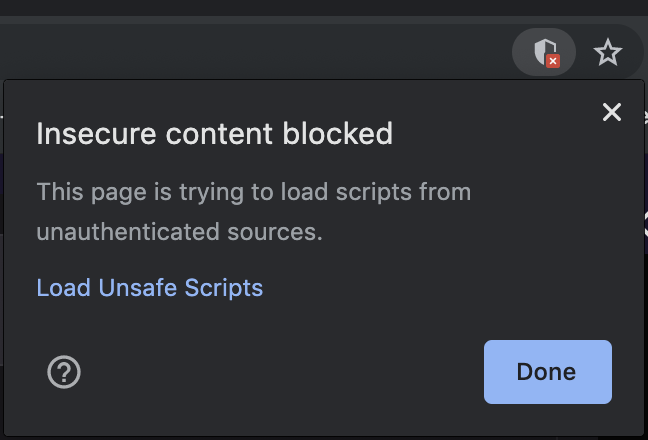
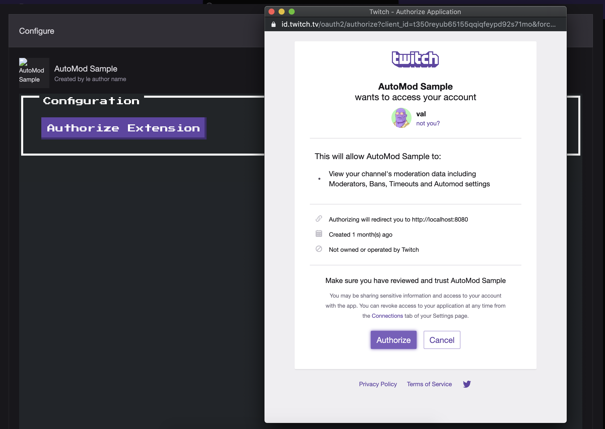

# automodder
A sample that demonstrates how to use the [Twitch API](https://dev.twitch.tv/docs/api/) from an extension. 

## What's in the sample
The panel extension allows viewers to conditionally "send" a message to the broadcaster if that message passes the channel's [AutoMod](https://help.twitch.tv/s/article/how-to-use-automod?language=en_US) settings. The EBS calls the `/helix/moderation/enforcements/status` [endpoint](https://dev.twitch.tv/docs/api/reference/#check-automod-status) to accomplish this.

During extension configuration, the broadcaster goes through the Twitch [OAuth Authorization Code Flow](https://dev.twitch.tv/docs/authentication/getting-tokens-oauth/#oauth-authorization-code-flow) to grant the extension the necessary scope (`moderation:read`) to call the endpoint. On success, the API access and refresh tokens are stored in a database (DynamoDB). 

## Requirements
- Go 1.12+ with [`dep`](https://github.com/golang/dep) for dependency management.
- DynamoDB for storing API credentials.

## Installation 
1. Create a new `Panel` extension. Set its `Testing Base URI` to `http://localhost:8080/` as we're not using HTTPS for example purposes. Add a secondary user to the `Testing Account Whitelist` to validate AutoMod functionality (messages sent as the broadcaster will always pass). 

2. Set the needed environment variables: 
```
export CLIENT_ID=
export API_SECRET=
export EXTENSION_SECRET=
export SESSION_SECRET=
```
`SESSION_SECRET` can be an arbitary string.

3. Create the DynamoDB table:
```
aws dynamodb create-table --table-name automodder-users \
--attribute-definitions AttributeName=UserID,AttributeType=S \
--key-schema AttributeName=UserID,KeyType=HASH \
--provisioned-throughput ReadCapacityUnits=5,WriteCapacityUnits=5
```

4. Clone the repo under your `$GOPATH/src` directory and navigate to the `ebs` directory; usually this would be `$GOPATH/src/github.com/twitchdev/extensions-samples/automodder/ebs`.

5. Install the dependencies:
`dep ensure`

## Usage

1. Run the extension EBS:
`go build && ./ebs`

To simplify development, the EBS also serves the front-end assets. You should see the extension if you open http://localhost:8080/panel.html in your browser.  

2. Install and configure the extension on your channel. You can do so via the https://dev.twitch.tv/console/extensions/CLIENT_ID/0.0.1/status page (see the `View on Twitch and Install` button). Note that you must explicitly allow HTTP content to be loaded when viewing the extension on twitch.tv . For example, in Chrome, this is done by clicking on the shield icon in the right corner of the location bar.  



3. As the broadcaser, open the extension configuration and give the extension permission to call the API on your behalf.



4. As the viewer (the one you've added to the whitelist), open the extension and see which messages would pass AutoMod or not. 


